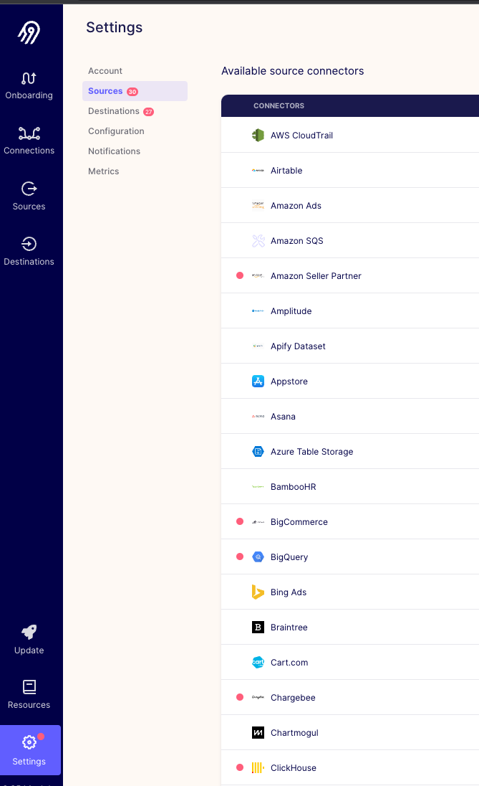

## Self-hosting the PlanetScale Airbyte Source Connector

1. [Self-publishing the docker image](#self-hosting-image)
2. [Add PlanetScale as a source in Airbyte](#planetscale-source)

<a name="self-hosting-image"></a>
### 1. Self-publishing the docker image

Run `make push REPO=<Your Dockerhub organization name>`

example : `make push REPO=phanatic` 

When the command finishes, you should seen an output that shows your pointer to the docker image on Docker Hub. 

```
Your image is now available at phanatic/airbyte-source:0.1.0
```

Full output
``` bash
 make push REPO=phanatic
==> Building docker image phanatic/airbyte-source:0.1.0
[+] Building 21.1s (17/17) FINISHED
 => [internal] load build definition from Dockerfile                                                                                                                                                        0.0s
 => => transferring dockerfile: 37B                                                                                                                                                                         0.0s
 => [internal] load .dockerignore                                                                                                                                                                           0.0s
 => => transferring context: 2B                                                                                                                                                                             0.0s
 => resolve image config for docker.io/docker/dockerfile:1                                                                                                                                                  0.3s
 => CACHED docker-image://docker.io/docker/dockerfile:1@sha256:42399d4635eddd7a9b8a24be879d2f9a930d0ed040a61324cfdf59ef1357b3b2                                                                             0.0s
 => [internal] load .dockerignore                                                                                                                                                                           0.0s
 => [internal] load build definition from Dockerfile                                                                                                                                                        0.0s
 => [internal] load metadata for docker.io/library/golang:1.17-bullseye                                                                                                                                     0.2s
 => [internal] load metadata for docker.io/library/debian:bullseye-slim                                                                                                                                     0.3s
 => [build 1/4] FROM docker.io/library/golang:1.17-bullseye@sha256:93872b0f54145f1ae135538c6bbe77a4f70dfa56d3fb27b30445f756b1b76f1d                                                                         0.0s
 => [internal] load build context                                                                                                                                                                           0.0s
 => => transferring context: 22.10kB                                                                                                                                                                        0.0s
 => [stage-1 1/3] FROM docker.io/library/debian:bullseye-slim@sha256:4c25ffa6ef572cf0d57da8c634769a08ae94529f7de5be5587ec8ce7b9b50f9c                                                                       0.0s
 => CACHED [build 2/4] WORKDIR /airbyte-source                                                                                                                                                              0.0s
 => [build 3/4] COPY . .                                                                                                                                                                                    0.1s
 => [build 4/4] RUN go build -o /connect                                                                                                                                                                   18.7s
 => CACHED [stage-1 2/3] RUN apt-get update && apt-get upgrade -y &&     apt-get install -y default-mysql-client ca-certificates &&     rm -rf /var/lib/apt/lists/*                                         0.0s
 => CACHED [stage-1 3/3] COPY --from=build /connect /usr/local/bin/                                                                                                                                         0.0s
 => exporting to image                                                                                                                                                                                      0.0s
 => => exporting layers                                                                                                                                                                                     0.0s
 => => writing image sha256:8a58a30fce558518064ac60d272e25a3ed3d60069ae1c273b12459770b8c39da                                                                                                                0.0s
 => => naming to docker.io/phanatic/airbyte-source:0.1.0                                                                                                                                                    0.0s

Use 'docker scan' to run Snyk tests against images to find vulnerabilities and learn how to fix them
export REPO=phanatic
==> Pushing docker image phanatic/airbyte-source:0.1.0
The push refers to repository [docker.io/phanatic/airbyte-source]
f64c71a2c1b6: Pushed
20f21a72c6f7: Pushed
7d0ebbe3f5d2: Pushed
latest: digest: sha256:2b679ef76b4de6cfeff341c6dbc6f4892c36f9327842d78766a4fd0a015ad274 size: 953
The push refers to repository [docker.io/phanatic/airbyte-source]
f64c71a2c1b6: Layer already exists
20f21a72c6f7: Layer already exists
7d0ebbe3f5d2: Layer already exists
0.1.0: digest: sha256:2b679ef76b4de6cfeff341c6dbc6f4892c36f9327842d78766a4fd0a015ad274 size: 953
==> Your image is now available at phanatic/airbyte-source:0.1.0
```

<a name="planetscale-source"></a>
### 2. Add your custom image as a source in Airbyte

1. In the Airbyte UI, navigate to `settings > sources`



2. Now, click on `New connector` as shown here


3. Enter the name of the docker image as shown by the output of the [Hosting the docker image](#hosting-image) section.
```
Connector display name: PlanetScale
Docker repository name: <name of the docker repository in the output>
Docker image tag : <tag name in the output>
Connector Documentation URL : https://docs.planetscale.com 
```


 
4. Now you're ready to connect Airbyte to your PlanetScale database! :tada:
